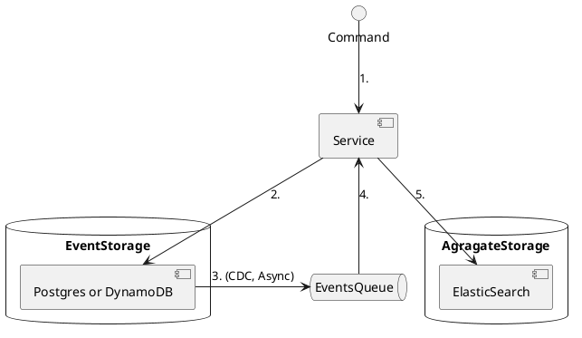

# Event Driven Design Elements (edd-el)

Simple lib to support building Event-Sourcing applications.

## Philosophy

<blockquote>
  It is not a framework!
</blockquote>

The main idea behind this library was not to be a framework, but rather usefull set of function that will express our
target architecture design.

It is designed with freedom. Library expresses desire to have stat pushed to the edge of the system and to help
engineers develop mathematically pure functions. But it has no limitations on what you can dou (i.e. You can use
directly DB connection at any time and make stuff dirty).

## Bootstraping

# Architecture

Entire system is build around 2 main components:

1. Event store
2. Aggregate store

# Supported event store implementation

Currently, implementations supports following event store implementation:

* PostgreSQL
* DynamoDB

# Supported aggregate store implementation

Currently, only one aggregate store is supported:

* ElasticSearch

# Architecture



## Commands

To register commands use `edd.core/reg-cmd`

``` clojure
(:require 
  [edd.core :as edd]))

(edd/reg-cmd :some-command 
   (fn [ctx cmd]
      (implementation here))
```


### Command dependecies

## JSON Serialization and De-Serialization

Serialization is implemented using `metosin/jsonista` (Crrently using fork of metosin `alpha-prosoft/jsonista`).
Implementation is actually using jackson. Special metion here is required because there is some customization done for
serializing keyword values and uuid data type.

All keyward **values** are prefixed with ":". If value is already containing ":" it will duplicate first ":". All uuid
values will be serialized prefixed with "#".

```clojure
=> (:require [lambda.util :as util])
=> (util/to-json {:a :b})
"{\"a\":\":b\"}"
=> (util/to-json {:a #uuid "d13d8c5c-2704-4fe1-8938-c339db9db15c"})
"{\"a\":\"#d13d8c5c-2704-4fe1-8938-c339db9db15c\"}"
=> (util/to-json {:a "#some"})
"{\"a\":\"##some\"}"
```

```clojure
=> (:require [lambda.util :as util])
=> (util/to-edn "{\"a\":\":b\"}")
{:a :b}
=> (util/to-edn "{\"a\":\"#d13d8c5c-2704-4fe1-8938-c339db9db15c\"}")
{:a #uuid "d13d8c5c-2704-4fe1-8938-c339db9db15c"}
=> (util/to-edn "{\"a\":\"##some\"}")
{:a "#some"}
```

## UUID Gen

In namespce `lambda/uuid` there is helper function `gen` which can be used got generating uuid's.

UUID generation is tricky from testing perspective. To help with that there is implementation of with-state mock is
provided. Example of usage:

```clojure 
=> (:require [clojure.test :refer :all]
             [lambda.test.fixture.state :as state]
             [lambda.uuid :as uuid])
=> (deftest test-input
    (let [uuid1 (uuid/gen)
          uuid2 (uuid/gen)  
          uuid3 (uuid/gen)]
      (state/with-state
        (with-redefs [uuid/gen (fn []
                             (state/pop-item
                              :uuid/gen
                              [uuid3 uuid2 uuid1]))]
          (is (= uuid1
              (uuid/gen)))
          (is (= uuid2
              (uuid/gen)))
          (is (= uuid3
              (uuid/gen)))
          (is (= nil
              (uuid/gen)))))))

```

## Authentication and metadata

I hearby declare authentication quite unflexible. When using from-api filter then user each request is being checked for
X-Authorization header (X-Authorization is used instead of standard because AWS LB and API Gateway sometimes take it
over). Header should contain signed JWT token.

You can expect to get structure like:

```
(def ctx 
  {:meta {:user {:id "user-id"
                 :email "user@email"
                 :role :user-role}}}
```

User role will be selected based on roles present in JWT token. At the moment only cognito is supported. If there are
more than one role possible, it is expected to receive `{:selected-role :user-role}` as part of request body. If this is
not the case then user wil receive anonymous role:

```
(def ctx 
  {:meta 
     {:user {:id "anonymous"
           :email "anonymous"
           :role :anonymous}}}
```

When handling request :meta map is passed on to all events, identities and sequences and is stored with them as well. 

So when create event you will get following stored in event store:

```
   (mock/verify-state :event-store [{:event-id  :ping
                                     :event-seq 1
                                     :id        id
                                     :meta      {:user {:email "john.smith@example.com"
                                                        :id    "john.smith@example.com"
                                                        :role  :group-1}}
                                     :role      :group-1
                                     :user      "john.smith@example.com"}])
```

Meta information is passed in :meta map to all effects as well. This is mechanism you can use to track user that
originally initiated request on api all over distributed system. Beside user stored inside you can also store any custom
data. This can be usefull from frontend to send to all backend services in distributed request metadata.

We will use it also for Blue/Green testing of our services. For example our UI tests will send to all requests made to
backend field which service is being tests. Then our router service will be able to route all requests correctly. More
information about blue green deployment in following sections. 
